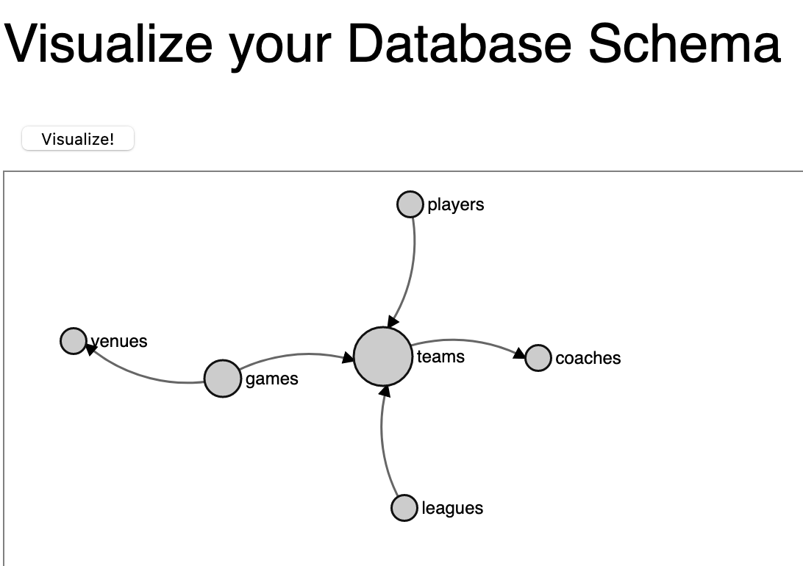

schemaviz
=========

Visually represent every table in your database schema, and the foreign key
relationships (and more) between these tables, using
[d3.js](http://d3js.org/ "d3.js home page").

# 0. If You're in A Hurry

The quickest way to get things up and running is to clone this repository,
and start a development server from the repo directory.

**Prerequisite:**

* Yarn ([install instructions](https://classic.yarnpkg.com/en/docs/install/))

**Steps:**

```
$ git clone https://github.com/shashank025/schemaviz.git
$ cd schemaviz/
$ yarn start
```

This will start a local webserver that visualizes the provided
[default schema](dist/schema.csv).

**Viewing the Schema on your Browser:**

Point your browser at the following url to view it:

* [Link to local webserver](http://localhost:8080/)

**Screenshot:**

Here's how it looks on my computer:



You can also see an example at the
[Schemaviz Github project page](http://shashank025.github.io/schemaviz/).

# 1. Approach

We use d3's
[force directed layout scheme](https://observablehq.com/@d3/mobile-patent-suits)
to produce an SVG image where each relation (table) in your schema is rendered
as a node. A directed edge is added from node A to node B if some columns in A
refer to some columns in B:

```
    A ---> B
```


Use the provided [schema.csv](dist/schema.csv) file to tell schemaviz what your
schema looks like. This file should contain comma-separated records of the form:

```
source,target
table1,table2
table5,
...
```

meaning that some columns in table `source` refer to some columns in table
`target` via a
[foreign key constraint](http://en.wikipedia.org/wiki/Foreign_key).
The `target` column can be `NULL`, since there can exist tables that don't refer
to other tables. But the `source` column will always be non-null.
The exact mechanism for populating the `schema.csv` file depends on the
database system you are using.

## 1.1 Postgres

We assume that the tables you are interested in reside in the `public` schema of
your postgres database. Roughly speaking, the following query returns the list
of tables in the public schema, along with the tables that each of these tables
refers to:

```sql

    SELECT
        c1.relname AS source, c2.relname AS target
      FROM pg_class c1
      JOIN pg_namespace n ON (n.oid = c1.relnamespace)
      LEFT JOIN pg_constraint s ON (s.conrelid = c1.oid and s.contype = 'f')
      LEFT JOIN pg_class c2 ON (c2.oid = s.confrelid)
     WHERE c1.relkind = 'r'
       AND n.nspname = 'public'
```

In conjunction with the `\copy` command, this can be used to easily populate the
schema csv file. For your convenience, this library includes a file,
[pgschema.sql](pgschema.sql), which does exactly this. Run the following `psql`
command in this directory to populate [schema.csv](schema.csv) from a Postgres
database of your choice:

```
$ psql "dbname=xxx host=xxx.com ..." -f pgschema.sql -qX > schema.csv
```

## 1.2 mysql

TODO (submit a PR if you know how to do this!)

# 2. Improvements (for large graphs)

A good visualization is particularly useful when the underlying database schema
is pretty large (1000+ tables). But it is not straightforward to render the
force directed layout for a graph that large. Here are some ideas to make the
visualization more useful:

1. Ability to search for and highlight a given table in the schema.
1. Expose the parameters of the force directed layout: `height`, `width`, `linkDistance`, `charge`, `gravity`, etc.
1. Vertical/horizontal scrolling through the rendered SVG.
1. [Fisheye distortion](http://bost.ocks.org/mike/fisheye/) to focus on a particular area of the graph.
